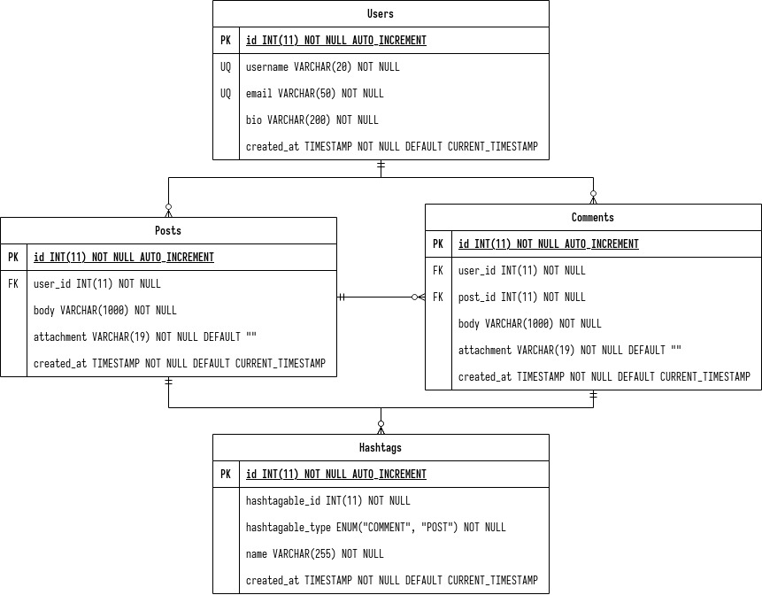

# Ruby - Sinatra - Geegeety

**EN**: Geegeety (Generasi GIGIH Tweety) — A Twitter-like social media for #GenerasiGIGIH.

**ID**: Geegeety (Generasi GIGIH Tweety) — Sebuah sosial media seperti Twitter untuk #GenerasiGIGIH.

## Status

MAINTAINING

Unit Tests: **100%** (_58_ examples, _0_ failures)

Code Coverage: **100%** (_24_ files in total, _809_ relevant lines, _809_ lines covered, _0_ lines missed)

# Problems Description

This API must be able to provide the following features, where:

1. User able to store their username, email, and bio description.
2. User able to create a post that might contain hashtag(s).
3. User able to see all posts that contain a certain hashtag.
4. User able to see the list of trending hashtags (top 5 posted hashtags in the past 24 hours).
5. User able to comment on a post that also might contain hashtag(s).
6. User able to attach things to a post.

# ERD Design



## Requirements

1. Ruby
2. MySQL/MariaDB
3. Postman

## Gems

1. mysql2
2. rack-test
3. rspec
4. simplecov
5. sinatra
6. thin

## How To

### Run the App Locally

1. Make sure all requirements are installed.

   ```bash
   $ ruby --version # 3.0.1
   $ gem --version # 3.2.15
   $ bundle --version # 2.2.15
   $ mysql --version # 15.1
   $ which postman # /usr/bin/postman
   ```

2. Clone this repository to your desired location.

   ```bash
   $ git clone https://github.com/rgxcp/geegeety.git
   ```

3. Change your directory into the project.

   ```bash
   $ cd geegeety
   ```

4. Install the Gem dependencies.

   ```bash
   bundle install
   ```

5. Create a new database.

   ```bash
   $ mysql -u `your-username` -p
   $ CREATE DATABASE geegeety_db;
   $ exit
   ```

6. Import the provided database schema.

   ```bash
   $ mysql -u `your-username` -p geegeety_db < app/migration/geegeety_db.sql
   ```

7. Copy the provided `.env.example` file to `.env`.

   ```bash
   $ cp .env.example .env
   ```

8. Change the `.env` file according to your machine setup.

   ```bash
   # .env
   export APP_ENV="development"
   export GEEGEETY_HOST="localhost"
   export GEEGEETY_USERNAME="your-username"
   export GEEGEETY_PASSWORD="your-password"
   export GEEGEETY_DATABASE="geegeety_db"
   ```

9. Load the `.env` file to your environment variables.

   ```bash
   $ source .env
   ```

10. Run the server.

    ```bash
    $ bundle exec rackup -p 4567 # accessible through http://localhost:4567
    ```

11. Hit the API endpoints using Postman and do-what-you-want-with-it!

### Run the App Tests

1. Make sure:

   - All requirements are installed.
   - All Gem dependencies are installed.
   - You're in the root project folder.

2. Run the following command:

   ```bash
   $ rspec -fd
   ```

### Run the Postman Collection Tests

1. Make sure the app is [running](#run-the-app-locally) properly in your local.
2. Import the `Geegeety.postman_collection.json` file to Postman.
3. Click the `Run` button inside the `Geegeety` collection folder in Postman.

## API Endpoints

<table>
  <thead>
    <th>Method</th>
    <th>URL</th>
    <th>Params (Body)</th>
    <th>Description</th>
  </thead>
  <tbody>
    <tr>
      <td>GET</td>
      <td>/api/v1/hashtags/trending</td>
      <td>
        <ul>
          <li>None</li>
        </ul>
      </td>
      <td>Get trending hashtags</td>
    </tr>
    <tr>
      <td>GET</td>
      <td>/api/v1/hashtags/:name/posts</td>
      <td>
        <ul>
          <li>None</li>
        </ul>
      </td>
      <td>Get posts from a hashtag</td>
    </tr>
    <tr>
      <td>POST</td>
      <td>/api/v1/users</td>
      <td>
        <ul>
          <li>username (<b>Required</b>)</li>
          <li>email (<b>Required</b>)</li>
          <li>bio (<b>Required</b>)</li>
        </ul>
      </td>
      <td>Create a new user</td>
    </tr>
    <tr>
      <td>POST</td>
      <td>/api/v1/posts</td>
      <td>
        <ul>
          <li>user_id (<b>Required</b>)</li>
          <li>body (<b>Required</b>)</li>
          <li>attachment (<i>Optional</i>)</li>
        </ul>
      </td>
      <td>Create a new post</td>
    </tr>
    <tr>
      <td>POST</td>
      <td>/api/v1/posts/:post_id/comments</td>
      <td>
        <ul>
          <li>user_id (<b>Required</b>)</li>
          <li>body (<b>Required</b>)</li>
          <li>attachment (<i>Optional</i>)</li>
        </ul>
      </td>
      <td>Create a new comment</td>
    </tr>
  </tbody>
</table>
